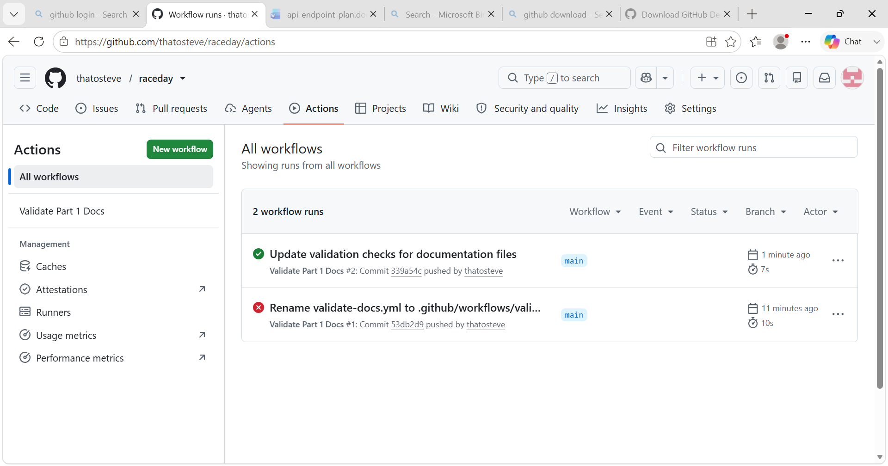

# RaceDay – Event Management System


## System Description

RaceDay is a full-stack, web-based event management system for the South African
road running, walking, and cycling community. It lets Event Organisers create and
manage events, categories, and participant results, while Participants browse
upcoming events, enter events by choosing a category, and track their personal
performance history.

This repository currently contains the **Part 1** planning artefacts: the entity
relationship diagram, the API endpoint plan, and the SQL database script. No
application code is written in this part — Parts 2 and 3 build the API and the MVC
front end on top of this plan.

## User Roles

The system supports two distinct roles:

- **Organiser** – can create, edit, and delete events; manage event categories;
  capture participant results; and view all enrolments for their events.
- **Participant** – can create an account, browse events, enter an event by
  selecting a category, view their own enrolments, and track their personal results.

Role-based access is enforced at the API level in Part 2 and reflected in the MVC
interface in Part 3.

## Repository Structure

```
/docs
  erd.dbml                 ERD source (paste into dbdiagram.io to render/export)
  erd.png                  Exported ERD image  <-- add this before submitting
  api-endpoint-plan.md     Full API endpoint specification (Section B)
  raceday_database.sql     SQL Server schema + seed data (Section C)
/.github/workflows
  validate-docs.yml        CI workflow validating the /docs structure
README.md
```

## The Data Model (6 entities)

`roles`, `users`, `events`, `categories`, `enrolments`, `results`.

Key design decisions:

- `roles` is a lookup table referenced by `users`, keeping role handling normalised.
- `enrolments` is the junction table resolving the many-to-many relationship between
  Participants and Events, and it carries the chosen `category_id` and enrolment
  `status` (Pending / Confirmed).
- `results` links to `enrolment_id` (one-to-one), so a result inherits the
  participant, event, and category from its enrolment without duplicating data.
- `profile_image_url` and `banner_image_url` are planned now for the Azure Blob
  Storage integration in Part 3, so the ERD, SQL, and later code stay consistent.

The SQL script in `/docs` matches the ERD exactly.

## Running the SQL Script

1. Open `docs/raceday_database.sql` in SQL Server Management Studio (SSMS).
2. Execute the script against a clean SQL Server instance. It creates the
   `RaceDayDb` database, all six tables with keys and constraints, and seeds
   realistic sample data (2 Organisers, 2 Participants, 3 Events, categories per
   event, sample enrolments, and sample results).
3. The verification query at the end prints row counts per table.

## CI/CD

A GitHub Actions workflow (`.github/workflows/validate-docs.yml`) runs on every push
and confirms the `/docs` folder contains the ERD, endpoint plan, and SQL script.



## Video Walkthrough


The video walks through the ERD decisions, the endpoint plan choices, and runs the
SQL script live in SSMS.

---


